<h1 align="center">
   
  Hey there, I'm Vivek Kalwar 👨‍💻
</h1>

<!-- Updated tagline to focus on Python development instead of AI research -->
<h3 align="center">🐍 Python Developer | Full-Stack Engineer | Tech Enthusiast</h3>

<!-- Added animated background with theme support -->

  <picture>
    <source media="(prefers-color-scheme: dark)" srcset="https://capsule-render.vercel.app/api?type=waving&color=0:667eea,100:764ba2&height=200&section=header&text=Welcome%20to%20My%20World&fontSize=40&fontColor=ffffff&animation=fadeIn">
    <source media="(prefers-color-scheme: light)" srcset="https://capsule-render.vercel.app/api?type=waving&color=0:a8edea,100:fed6e3&height=200&section=header&text=Welcome%20to%20My%20World&fontSize=40&fontColor=000000&animation=fadeIn">
    
  </picture>

---

  
  
  

<!-- Updated typing animation to focus on Python and web development -->

  

---

## 🎯 About Me

<!-- Replaced broken AI coding GIF with working Python coding animation -->

<!-- Updated description to focus on Python development instead of AI research -->
- 🎓 **Computer Engineering Graduate** specializing in **Python Development**
- 🐍 **Python Expert** with expertise in web frameworks and backend development
- 💻 Passionate about **building scalable web applications and clean code**
- 🚀 Experience with **Django, Flask, FastAPI, and modern web technologies**
- 🔧 **2025 Goals**: Master advanced Python patterns, contribute to open-source, build production apps
- ⚡ **Fun fact**: I can debug Python code faster than I can make coffee! ☕
- 📫 Let's connect: **vivekkalwar95@gmail.com**

---

## 🌟 What I'm Up To  

```mermaid
  flowchart LR
    A[🚀 Current Focus] -->|Learning Path| B[📚 Learning]
    B --> C[🛠️ Working On]
    C --> D[🧑‍💻 Expertise]
    D --> E[💡 Interests]
    E --> F[✨ Passion]
    F --> G[🐍 Fun Fact]

    A --> A1[⚡ Django]
    A --> A2[🚀 FastAPI]
    A --> A3[⚛️ React]

    B --> B1[🐳 Docker]
    B --> B2[🧩 System Design]
    B --> B3[☁️ Cloud]

    C --> C1[📖 Narrative Scribe Nexus]
    C --> C2[🖥️ Desktop Controller]

    D --> D1[🐍 Python]
    D --> D2[📜 JavaScript]
    D --> D3[🗄️ SQL]
    D --> D4[🔧 Git]

```

---

## 🌐 Let's Connect & Collaborate

  
  
  
  

> 💬 **Open to**: Python development roles, web development projects, open-source contributions, and tech discussions!

---

## 🛠️ Tech Stack & Tools

<!-- Reorganized to prioritize Python and web development -->
### 🐍 Core Programming

  

### 🌐 Web Development and Frameworks

  

### 🗄️ Databases & Backend

  

### ☁️ DevOps & Cloud

  

### 🔧 Tools & Others

  

---

## 🚀 Featured Projects
<!-- Updated projects to showcase Narrative Scribe Nexus and Desktop Controller -->

| Project | Description | Tech Stack | Links |
|---------|-------------|------------|-------|
| 📖 **Narrative Scribe Nexus** | AI-powered story generation platform with video rendering and multimedia integration | React, Node.js, Gemini API, Pexels API, ImageMagick | [Demo](https://narrativescribenexus.vercel.app/)|
| 🖥️ **Desktop Controller** | Smart desktop app with Python GUI for Controlling using Hand Guesture | Python, Tkinter | [Code](https://github.com/Viivveekk/Desktop-Controller) |

---

## 📊 GitHub Analytics & Activity

<!-- Added 3D contribution graph and enhanced visual elements -->

  

### 🔥 Contribution Streak

### 📈 GitHub Statistics

### 💻 Most Used Languages

### 🐍 3D Contribution Snake
<picture>
  <source media="(prefers-color-scheme: dark)" srcset="https://raw.githubusercontent.com/platane/snk/output/github-contribution-grid-snake-dark.svg">
  <source media="(prefers-color-scheme: light)" srcset="https://raw.githubusercontent.com/platane/snk/output/github-contribution-grid-snake.svg">
  
</picture>

---

## 💡Coding Inspiration

  

---

## 🎵 Coding Soundtrack

<!-- Updated coding playlist for development -->
When I'm coding and building applications:
- 🎧 Lo-fi Hip Hop for focused coding sessions
- 🎼 Instrumental music for debugging complex problems
- 🎹 Electronic beats for late-night development
- 🎵 Ambient sounds for design and planning

---

<!-- Added matrix rain effect animation -->

  
### 🌟 "Any sufficiently advanced technology is indistinguishable from magic." – Arthur C. Clarke

**Thanks for visiting! Let's build something amazing together! 🚀**

<!-- Enhanced footer with better theme support -->
<picture>
  <source media="(prefers-color-scheme: dark)" srcset="https://capsule-render.vercel.app/api?type=waving&color=0:667eea,100:764ba2&height=120&section=footer&animation=twinkling">
  <source media="(prefers-color-scheme: light)" srcset="https://capsule-render.vercel.app/api?type=waving&color=0:a8edea,100:fed6e3&height=120&section=footer&animation=twinkling">
  
</picture>

